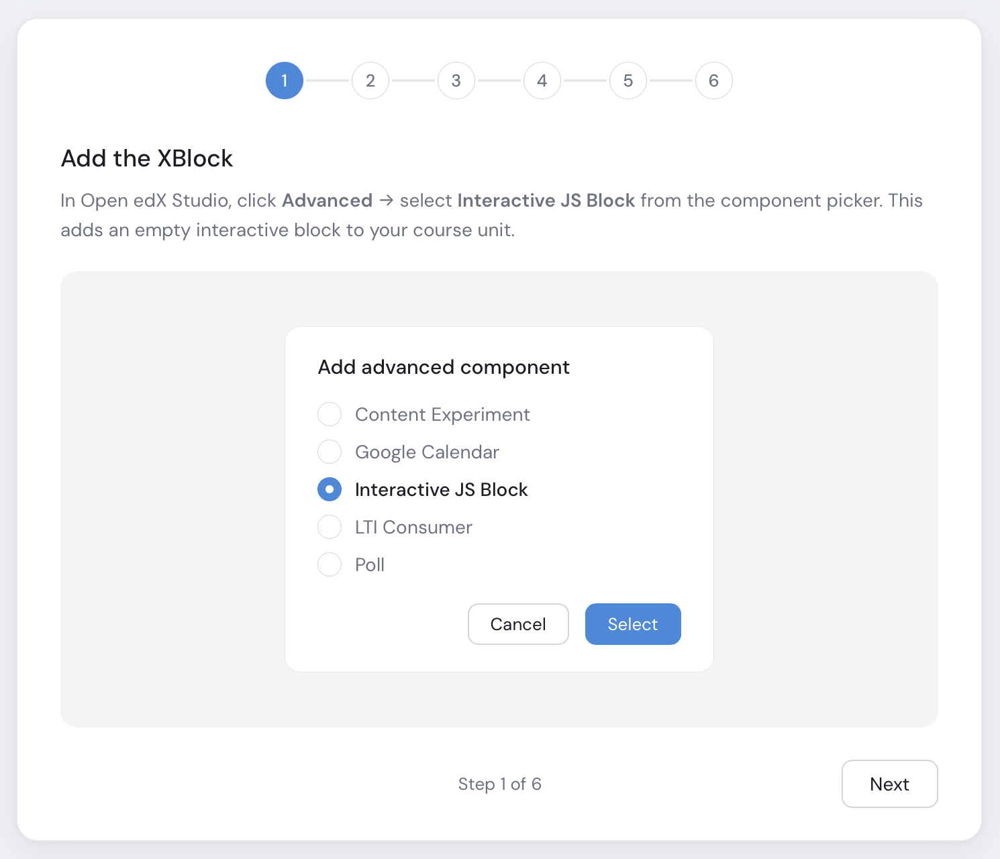

InteractiveJSBlock
==================

|license| |status|

.. |license| image:: https://img.shields.io/badge/license-AGPL--3.0-blue.svg
   :target: https://github.com/blend-ed/interactive-html-xblock/blob/main/LICENSE
.. |status| image:: https://img.shields.io/badge/status-alpha-orange.svg

A custom Open edX XBlock for creating interactive HTML/CSS/JS content with learner interaction tracking and auto-grading.

This XBlock allows course authors to define custom HTML, CSS, and JavaScript content and automatically captures learner interactions in JSON format for grading, analytics, or state restoration.

Features
--------

* **Custom HTML/CSS/JS Content**: Authors define their own HTML, CSS, and JavaScript content in the Studio editor
* **Learner Interaction Tracking**: Captures learner interactions via the ``submitInteraction(data)`` API
* **Auto-Grading**: Optional automatic grading — either via author JavaScript or server-side answer matching
* **Completion Tracking**: Emits completion events when learners submit an interaction
* **Feedback Display**: Configurable correct/incorrect feedback with custom messages
* **Previous Response**: Optionally shows learners their previous response on return
* **Test Grading**: Studio includes a "Test Grading" panel to verify grading config before publishing
* **Debug Mode**: Staff-only debug panel showing block state
* **Masquerade Support**: Staff can view individual student state via Open edX's "View as Specific Learner"

Requirements
------------

* Python 3.11+
* Django 4.2 or 5.2
* Open edX (Redwood or later)

Installation
------------

System Administrator
~~~~~~~~~~~~~~~~~~~~

Add to your ``OPENEDX_EXTRA_PIP_REQUIREMENTS``:

.. code-block::

    git+https://github.com/blend-ed/interactive-html-xblock.git@main

Course Staff
~~~~~~~~~~~~

Add ``interactive_js_block`` to your course's Advanced Module List:

    Settings → Advanced Settings → Advanced Module List

Usage
-----

Studio View (Authoring)
~~~~~~~~~~~~~~~~~~~~~~~

1. Add the InteractiveJSBlock component to your course
2. Click "Edit" to open the Studio editor
3. Configure the following:

   - **HTML Content**: The structure of your interactive element
   - **CSS Styles**: Styling for your content
   - **JavaScript Code**: Interactivity logic using ``submitInteraction(data)``
   - **Grading Configuration**: Answer matching mode, correct answer(s), and feedback messages

4. Use the ``submitInteraction(data)`` function in your JavaScript to capture learner interactions:

   .. code-block:: javascript

       function submitAnswer(answer) {
         submitInteraction({
           answer: answer,
           correct: answer === "Paris",
           timeSpent: Math.round((Date.now() - startTime) / 1000)
         });
       }

5. Use the **Test Grading** panel in Studio to verify your grading config works before publishing.

LMS View (Learner)
~~~~~~~~~~~~~~~~~~

Learners see the rendered HTML content with the author's CSS and JavaScript applied. The XBlock automatically provides the ``submitInteraction()`` function for capturing interactions.

Configuration Options
---------------------

* **Display Name**: The title shown to learners
* **Weight**: Points value for grading
* **Enable Debug Mode**: Show debug panel (staff only)
* **Auto Grade Enabled**: Enable automatic grading
* **Show Feedback to Learners**: Show correct/incorrect feedback after submission
* **Show Previous Response**: Show learners their previous response on return
* **Grading Configuration**: Answer matching mode (None / Single Answer / Multiple Fields), correct answer value(s), and feedback messages

Auto-Grading
------------

There are two ways to grade interactions:

**1. Author JavaScript provides correctness directly (recommended for most cases):**

Include a ``correct`` boolean in the data passed to ``submitInteraction()``:

.. code-block:: javascript

    submitInteraction({
      answer: "Paris",
      correct: true,
      timeSpent: 45
    });

The XBlock uses this directly — no server-side config needed. If you've set feedback messages in Grading Configuration, they'll be shown automatically.

**2. Server-side answer matching:**

Set "Auto Grade Enabled" to True and configure the Grading Configuration in Studio:

- **Single Answer**: Set the correct answer value. The server compares case-insensitively.
- **Multiple Fields**: Add field name / expected value pairs. Partial credit is awarded proportionally.

Configure feedback messages (Correct Feedback / Incorrect Feedback) to show custom responses.

Staff Data Access
-----------------

Staff can view individual student state using the platform's built-in **masquerade** feature ("View as Specific Learner"). This works because the XBlock sets ``show_in_read_only_mode = True``. Bulk data exports are available through the Open edX instructor dashboard.

Development
-----------

Setup
~~~~~

.. code-block:: bash

    pip install -e .                     # development install
    make requirements                    # full dev environment

Testing
~~~~~~~

.. code-block:: bash

    tox -e py312-django52                # Django 5.2
    tox -e py312-django42                # Django 4.2
    pytest tests/test_interactive_js_block.py  # specific file
    pytest tests/test_interactive_js_block.py::TestInteractiveJSBlock::test_method_name  # single test

Quality
~~~~~~~

.. code-block:: bash

    tox -e quality                       # pylint, pycodestyle, pydocstyle, isort

Development with Tutor
~~~~~~~~~~~~~~~~~~~~~~

1. Install in development mode:

   .. code-block:: bash

       cd interactive-html-xblock
       pip install -e .

2. Add to Tutor mounts:

   .. code-block:: bash

       tutor mounts add /path/to/interactive-html-xblock

3. Create a Tutor plugin (``touch $(tutor plugins printroot)/mount_interactive_html_xblock.py``):

   .. code-block:: python

       from tutor import hooks
       hooks.Filters.MOUNTED_DIRECTORIES.add_item(("openedx", "interactive_html_xblock"))

4. Enable and build:

   .. code-block:: bash

       tutor plugins enable mount_interactive_html_xblock
       tutor images build openedx-dev
       tutor dev start -d

Example
-------

This is the default content when you add a new block:

.. code-block:: html

    

      <h3>Sample Quiz</h3>
      
What is the capital of France?

      

        <button onclick="submitAnswer('Paris')">Paris</button>
        <button onclick="submitAnswer('London')">London</button>
        <button onclick="submitAnswer('Berlin')">Berlin</button>
      

    

.. code-block:: javascript

    var startTime = Date.now();

    function submitAnswer(answer) {
      submitInteraction({
        answer: answer,
        correct: answer === "Paris",
        timeSpent: Math.round((Date.now() - startTime) / 1000)
      });
    }

License
-------

Copyright © 2026 Blend-ed.

Interactive XBlock is free software: you can redistribute it and/or modify it under the terms of the `GNU Affero General Public License <LICENSE>`_ as published by the Free Software Foundation, either version 3 of the License, or (at your option) any later version. See the ``LICENSE`` file in this repository for the full license text.

Maintainer: zameel7.
